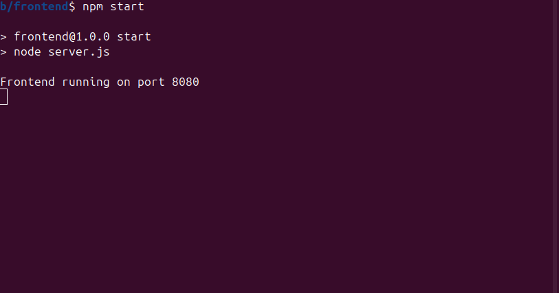
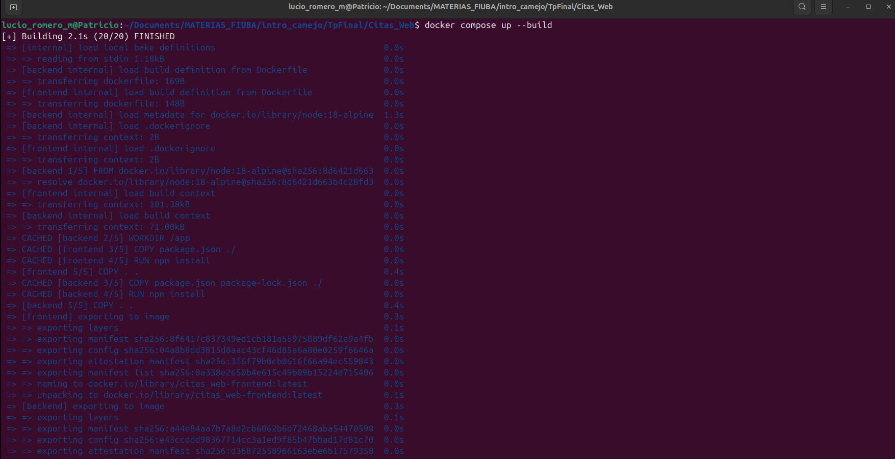
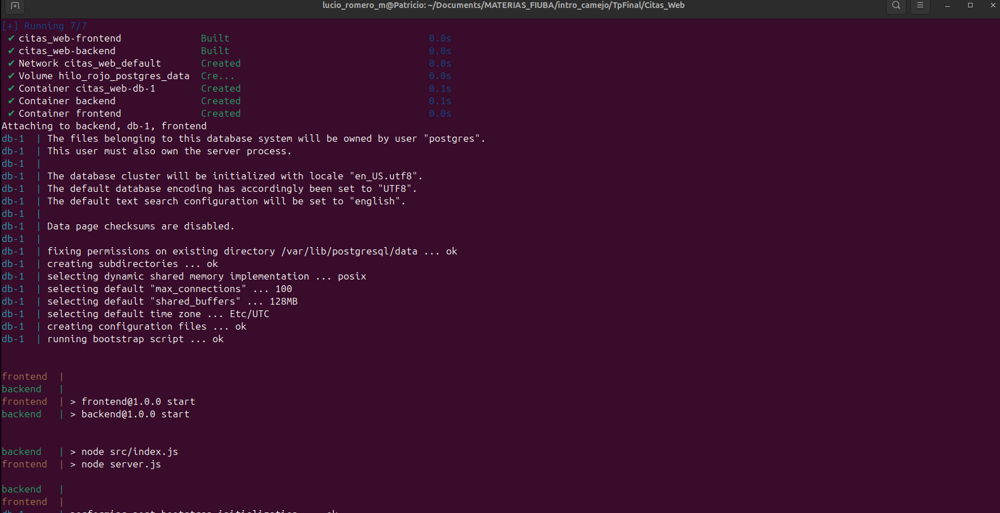
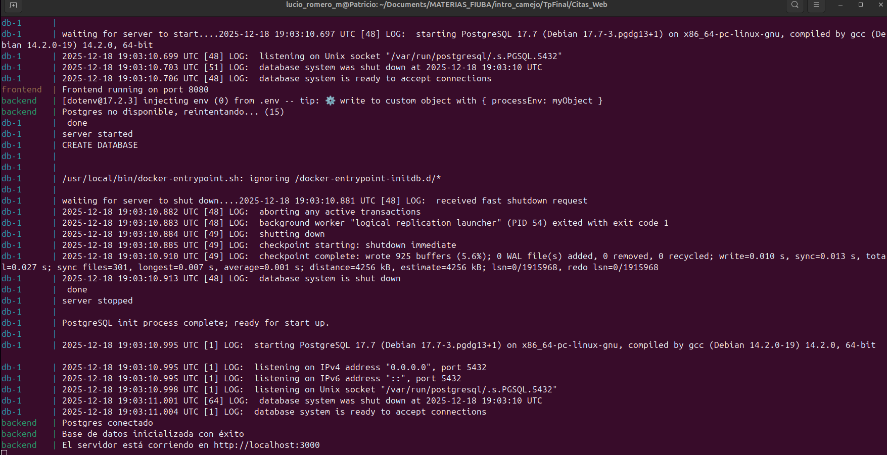
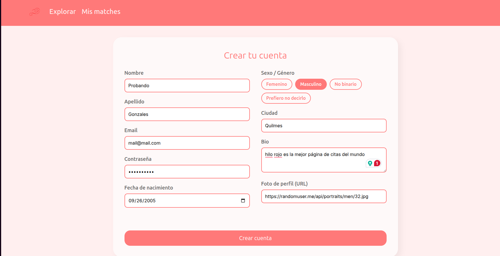
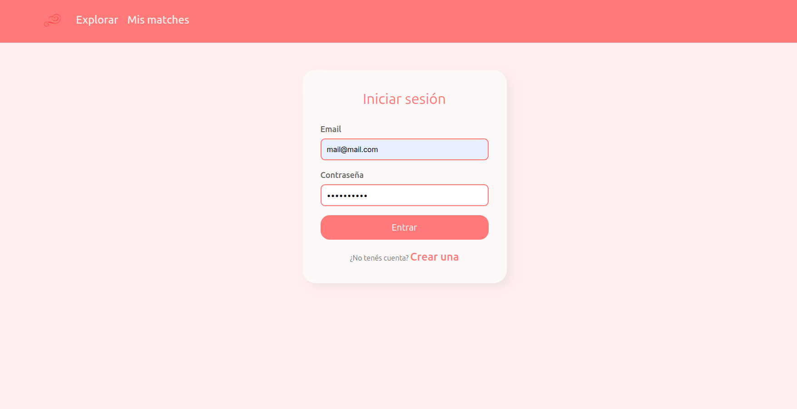
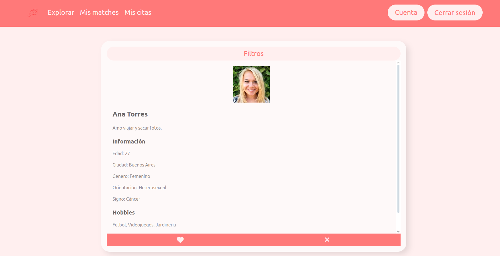
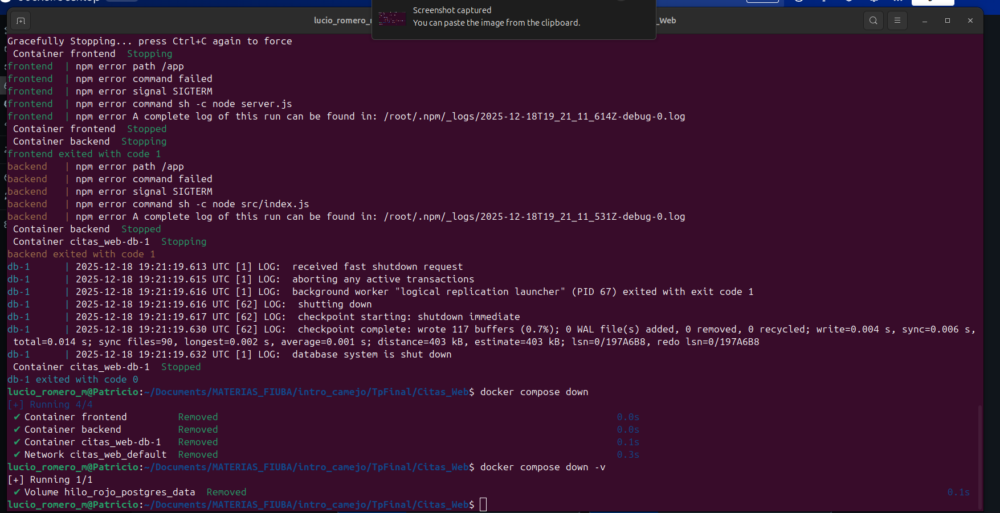

# Hilo Rojo
- Te ayudamos a encontrar el otro extremo de tu hilo.

# Creadores:
* Tomás Zambrano
* Tobías Marmolejo
* Ezequiel Widder
* Lucio Romero Mascaró

*Hilo Rojo* es una plataforma web diseñada para conectar personas basándose en sus gustos, pasiones y estilos de vida. 
Es única, con una funcionalidad para planificar las citas integrada. Podes dar likes, dislikes, hacer match con mujeres y/o hombres que te likeen a vos. Podes crear tu perfil completo para conquistar a todas las personas que quieras.

El sistema funciona con el recorrido perfecto:
1.  *Crea tu perfil:* Registras tu cuenta definiendo tus hobbies, hábitos, podes dejar una descripcion especial que te identifique.
2.  *Explorar:* Se muestran los perfiles de las personas. Si querés ser mas específico, existe la opción de 'Filtro' en la que podes usar para filtrar por género, hábitos, edades, etc.
3.  *Match:* El match es un algoritmo de reciprocidad. Si vos likeas a 'Ana' y 'Ana' te likea a vos, se genera el Match.
4.  *Citas:* Una vez conectados, pueden agendar una cita formal (con lugar, fecha y tipo de encuentro).
5.  *Feedback:* Luego de verse, tienen la opción de calificar la experiencia, lo que permite mantener una comunidad segura y confiable.

--
AHORA VAMOS A EXPLICAR:
1. Qué tecnologías utilizamos 
2. Instrucciones de instalación y requisitos 
3. Instucciones para levantar el sistema
4. Guía de uso y Pruebas que podes hacer
5. Cómo apagar todo y que te quede limpio
6. Agradecimientos y origen de tu hilo rojo
--

# Tecnologías Utilizadas

Para desarrollar este proyecto usamos:

*Frontend:*
- HTML: Estructura y diseño de las páginas.
- CSS: Estilos rápidos y limpios (usamos Bulma como base y agregamos estilos propios).
- JavaScript: Interacción y llamadas al Backend usando fetch API.

*Backend:*
- Node.js: Entorno de ejecución para JavaScript del lado del servidor.
- Express.js: Framework para manejar las rutas y el servidor HTTP.
- PostgreSQL: Motor de la base de datos.
- pg (node postgres): Librería para conectar Node.js con la base de datos PostgreSQL.

*Infraestructura:*
- Docker: Para tener contenedores de la base de datos y la aplicación.
- Docker Compose: Para levantar los servicios (base de datos, backend, frontend).
- Git: Control de todo, a medida de que lo fuimos haciendo.

# Instrucciones de Instalación

Este proyecto está preparado para correr en cualquier máquina que tenga Docker y Node.js.

*Requisitos Previos:*
1. Docker Desktop: Tiene que estar instalado y abierto (la lucecita verde de "Engine running").
 (ctrl + click izquierdo para ver la screenshot)

2. Node.js: Necesario para instalar las librerías.

3. Git: Para clonar el repositorio (o solo descargar el código).

*Instalación de Dependencias:*
(los comandos utilizados son en la terminal de Bash)

Primero instalá las librerías del backend. Abrí una terminal en la carpeta 'backend' del proyecto y ejecutá:
*
cd backend
npm install
*

Luego hacé lo mismo para el frontend:
*
cd ..
cd frontend
npm install
*
Te va a crear las carpetas de 'node_modules' (una adentro de la carpeta frontend y otra adentro de backend)

# Cómo correr el proyecto

Ofrecemos dos formas de levantar el sistema. Recomendamos la Opción 1 solo para *desarrollo* porque es más fácil ver los errores y hacer cambios.

*OPCIÓN 1:*

En este modo, la Base de Datos corre en Docker, pero el Backend y el Frontend corren en tus terminales (distintas).

Paso 1: Levantar la Base de Datos
Desde la carpeta principal (donde está el archivo docker-compose.yml), ejecutá:
docker compose up -d db

Esto levanta un contenedor de PostgreSQL y lo deja corriendo en segundo plano. Verificá que se levantó correctamente con:
*
docker ps
*
Tendrías ver el contenedor postgres:17 corriendo.
 (ctrl + click izquierdo para ver la screenshot)

Paso 2: Configurar el Backend (.env)

Andá a la carpeta backend y creá (o modificá si ya existe) el archivo .env con estos datos:
-
PORT=3000
DB_USER=postgres
DB_PASS=postgres
DB_HOST=localhost
DB_NAME=hilo_rojo
DB_PORT=5432
-
 (ctrl + click izquierdo para ver la screenshot)

Paso 3: Iniciar el Backend
En una terminal nueva (ctrl + alt + t), dentro de la carpeta backend, ejecutá:z
*
npm start
*
Si todo está bien, vas a ver:z
 (ctrl + click izquierdo para ver la screenshot)

Paso 4: Iniciar el Frontend
Abrí una nueva terminal, andá a la carpeta frontend y:
*
npm start
*
Esto levanta un servidor local. Abrí tu navegador y andá a: http://localhost:8080
 (ctrl + click izquierdo para ver la screenshot)

Esta es la pagina del login que tendrías que ver:
 (ctrl + click izquierdo para ver la screenshot)

*OPCIÓN 2: Modo Producción (Full Docker)*

Usen esta opción si quieren ver el proyecto funcionando 100% aislado en contenedores.
Modificá el archivo backend/.env para que tenga:
-
PORT=3000
DB_HOST=db
DB_USER=postgres
DB_PASS=postgres
DB_NAME=hilo_rojo
DB_PORT=5432
-

La diferencia es DB_HOST=db (en vez de localhost), porque dentro de la red de Docker los servicios se comunican por nombre.

En la raíz del proyecto, ejecutá:
*
docker compose up --build
*
La terminal muestra:
 (ctrl + click izquierdo para ver la screenshot)

 (ctrl + click izquierdo para ver la screenshot)

 (ctrl + click izquierdo para ver la screenshot)

Cuando termine, abrí el navegador en http://localhost:8080.

# Guía de Uso y Tests

Para verificar que todo funciona desde cero, seguí estos pasos:

1. *Registro de Usuario:* En login, anda a Crear Cuenta.

 (ctrl + click izquierdo para ver la screenshot)

2. *Login:* hace el login con la cuenta que acabas de crear. vas a poder editar tu cuenta para completarla.

 (ctrl + click izquierdo para ver la screenshot)
 (ctrl + click izquierdo para ver la screenshot)

3. *Explorar:* En la pantalla principal vas a ver a otros usuarios. Tenés dos botones: X para dislike (pasás al siguiente) y corazón para like. Si le das like a alguien que ya te dio like a vos, el sistema te avisa con un alerta de "¡MATCH!". También podés usar los filtros para buscar usuarios específicos.

 (ctrl + click izquierdo para ver la screenshot)
[SCREEN FILTRO]

4. *Mis Matches:* Aparecen todas las personas con las que conectaste. Podés ver su foto y nombre, y tenés opciones para eliminar el match o organizar un evento.

[SCREEN MATCHES]

5. *Planificar Cita:* Dentro de "Mis Matches", hacé clic en "Organizar evento". Esto te lleva a un formulario donde definís lugar, fecha y hora, tipo de encuentro y duración.

[SCREEN crear cita]

6. *Mis Citas y Feedback:* En "Mis Citas" vas a ver los encuentros programados. Las citas pendientes podés cancelarlas o editarlas para cambiar el horario, lugar, etc. Las citas anteriores podés calificarlas con puntajes sobre el evento, la pareja, puntualidad, fluidez, comodidad y calidad.

[CITAS PENDIENTES / ANTERIORES]
[EDITAR CITA]
[FEEDBACK]

# APAGAR TODO: 
Asegúrate de estar en el mismo directorio que el docker-compose.yml (el directorio main Citas_web/)
*
CTRL + C

docker compose down

docker compose down -v
*
Para y elimina los contenedores, redes y volúmenes creados por docker compose up.

el docker compose down -v hace lo mismo que el comando anterior, pero también elimina los volúmenes nombrados que no son volúmenes anónimos, liberando espacio en disco. (una limpieza completa).

 (ctrl + click izquierdo para ver la screenshot)

# Agradecimiento
De parte de los Creadores, les damos las gracias:
- a toda persona que leyó todo y usó la plataforma *Hilo rojo*.
- a los profesores que nos enseñaron y dieron las herramientas para crear todo.

" El hilo rojo en la mitología japonesa es una creencia que dice que dos personas predestinadas están unidas por un hilo rojo invisible, atado al dedo meñique o tobillo, que los conecta para siempre, sin importar el tiempo, lugar o circunstancias, aunque pueda enredarse o tensarse, nunca se rompe, simbolizando almas gemelas y un destino increíble. "
